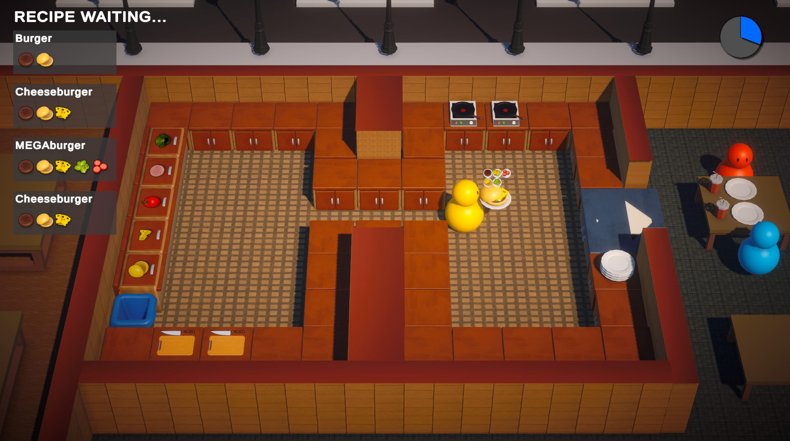
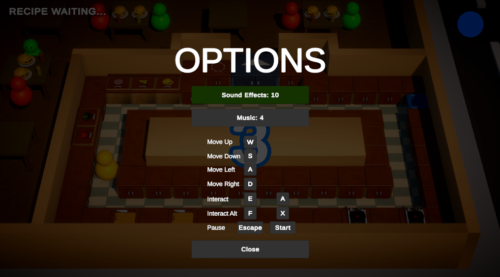
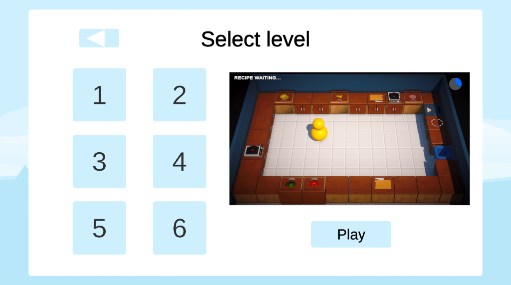

# Undercooked

# Summary

This game is a study case for the game Overcooked! 2.

All art assets like Textures, models, audio clips etc where created by the indie game maker Code Monkey for this [Free Complete Unity Course](https://www.youtube.com/watch?v=AmGSEH7QcDg).

However, the game structure and the source-code were created by me and they are very different from the course.

This project uses many Unity Packages created and published by me. All of them are on the MIT license so you can freely use them into your project

#How to play

You must prepare, cook and serve up some tasty orders before time ends!

After the initial count down, Orders will be received on the screen's top left corner. You must collect the right ingredients, prepare and plate them before delivery.

Your score will increase according in how quickly you deliver those orders.

#Controls

 - Tab - Switch between Chefs.
 - AWSD or Arrow Keys - Movement.
 - F - Interact with Items (Cutting Table, Stove Table)
 - E - Interact with Plate and Ingredients (Tomato, Cheese, Bread etc)

 

 #Levels
The game currently has 6 levels.
 